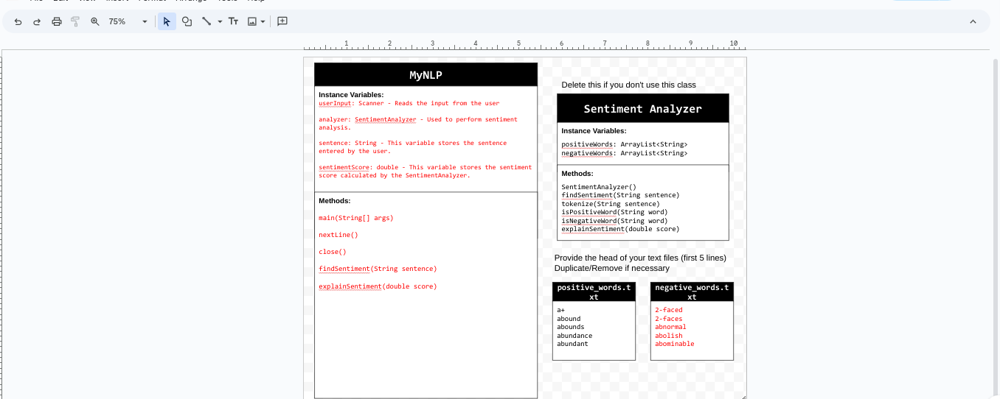
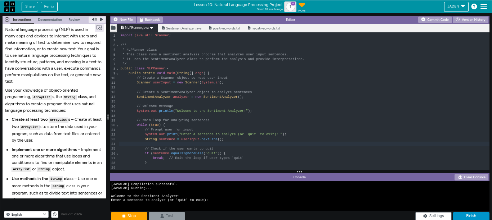

# Unit 6 - Natural Language Processing Project

## Introduction

Natural language processing (NLP) is used in many apps and devices to interact with users and make meaning of text to determine how to respond, find information, or to create new text. Your goal is to use natural language processing techniques to identify structure, patterns, and meaning in a text to have conversations with a user, execute commands, perform manipulations on the text, or generate new text.

## Requirements

Use your knowledge of object-oriented programming, ArrayLists, the String class, and algorithms to create a program that uses natural language processing techniques:

- **Create at least two ArrayLists** – Create at least two ArrayLists to store the data used in your program, such as data from text files or entered by the user.
- **Implement one or more algorithms** – Implement one or more algorithms that use loops and conditionals to find or manipulate elements in an ArrayList or String object.
- **Use methods in the String classs** - Use one or more methods in the String class in your program, such as to divide text into sentences or phrases.
- **Use at least one natural language processing technique** – Use a natural language processing technique to process, analyze, and/or generate text.
- **Document your code** – Use comments to explain the purpose of the methods and code segments and note any preconditions and postconditions.

## UML Diagram

Put and image of your UML Diagram here. Upload the image of your UML Diagram to your repository, then use the Markdown syntax to insert your image here. Make sure your image file name is one word, otherwise it might not properly get display on this README.

## Video

Record a short video of your project to display here on your README. You can do this by:

- Screen record your project running on Code.org.
- Upload that recording to YouTube.
- Take a thumbnail for your image.
- Upload the thumbnail image to your repo.
- Use the following markdown code:

## Project Description

In my application, I created a Sentiment Analyzer program. This program makes it so that the user types any sentence he/she chooses in which the program will then respond with the Sentiment Score from  (-1.0 being the lowest to 1.0 being the highest). The program will also respond with the interpretation which can vary from "Neutral", "Positive", "Negative", "Very Positive" or "Vey Negative" depending on what the user creates in his/her sentence. The two text files that helped me with my project was positive_words.txt and negative_words.txt which I found on Github. Based on the words listed in the user's sentence, the program analyzes each word and gives a rating from a -1.0 to 1.0 ratio.  

## NLP Techniques

The NLP I implemented in my project was the Sentiment Analysis which basically determines the emotional tone or attitude expressed in the sentence/txt. I chose the Sentiment Analyzer to be my project because I got inspired by Lesson 9: ArrayList and String Algorithms Investigation and Modify (Bubbles 1-4). These bubbles gave an example on how the sentiment is called for from the various songs and how negative or positive the outcome will be. I implemented this similar concept to my project, except I decided to make it so the program will analyze each word from the given sentence and so forth. Not only does my program analyze the sentiment of a given sentence, but it breaks a sentence into individual words which I call "tokens" and converts the sentence to lowercase and seperate words based on non-letter characters to make it easier. It will then store these tokens and convert the entire sentence to lowercase to match the txt files (since my txt files are all lowercase) and then initialize an empty string to build each word. It will then process each character in the sentence using the for loop and if else-if statement to check whether or not the character is a lowercase sentence. However, if the sentence contains a non letter with words attached, it will add it to the list of tokens. In addition, if it is not a letter and the currentWord is empty, it wil lthen skip. (This includes punctuation or spacing). Lastly, it will then return the tokens and then check if the word is positive or negative based on the txt file after changing and making sure all the letters are lowercase for the txt files. The scoring for the sentiment is described in explainSentiment, where it shows the given scoring guideline for the cooresponding word. 